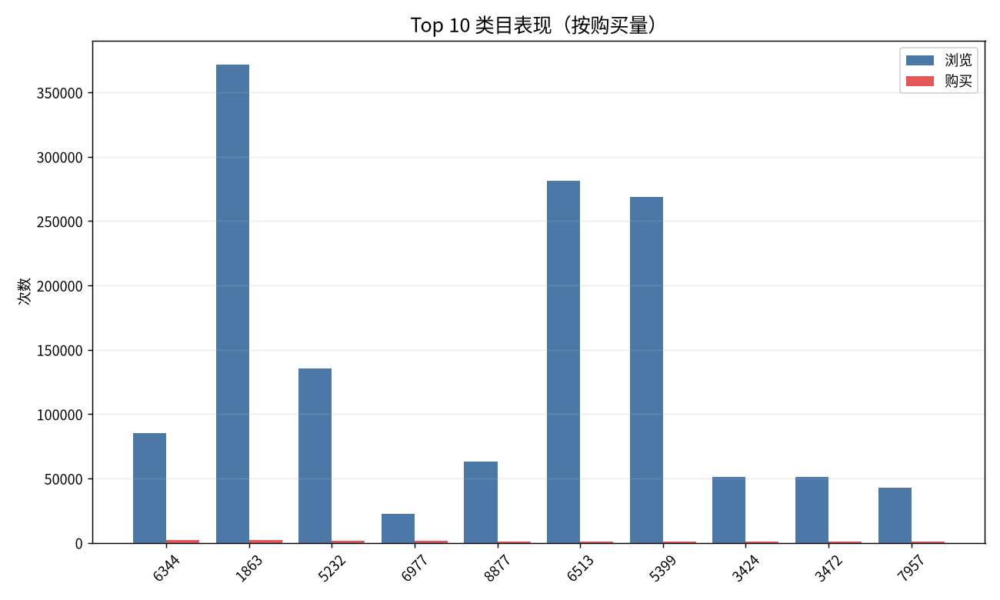
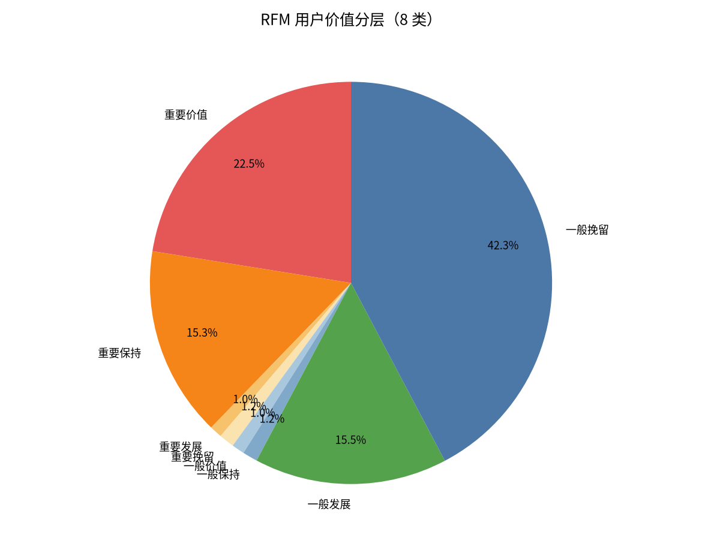
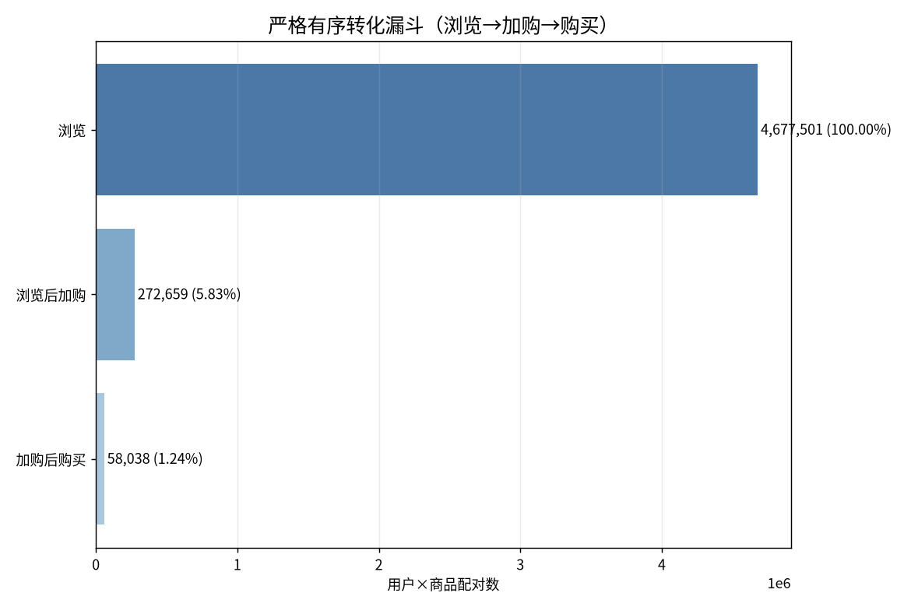
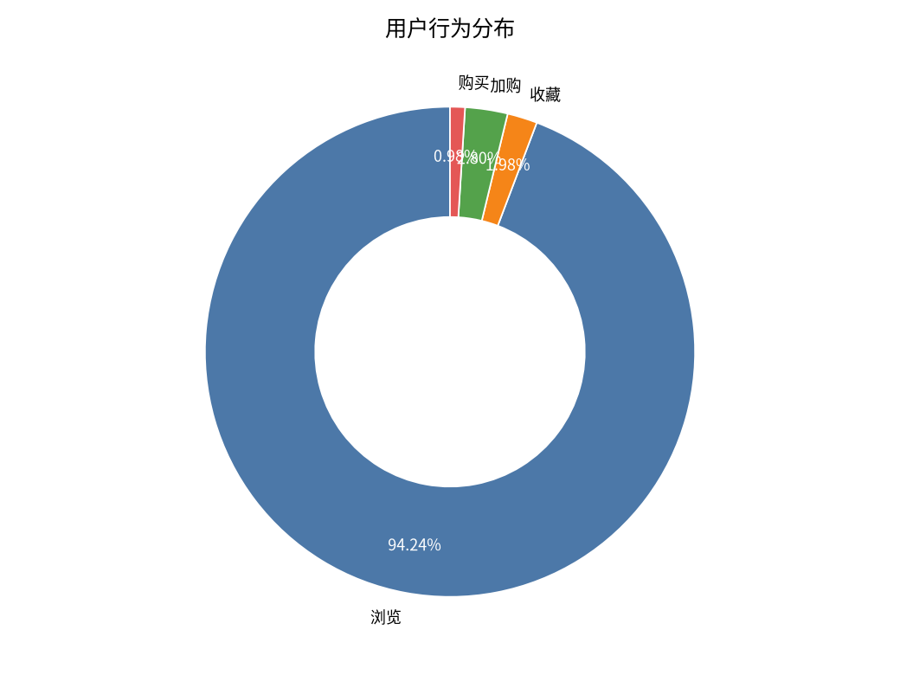
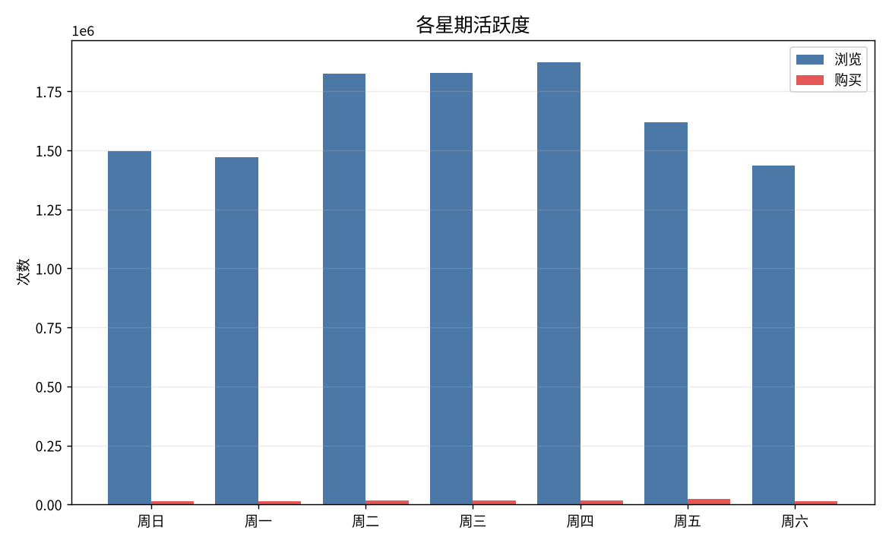
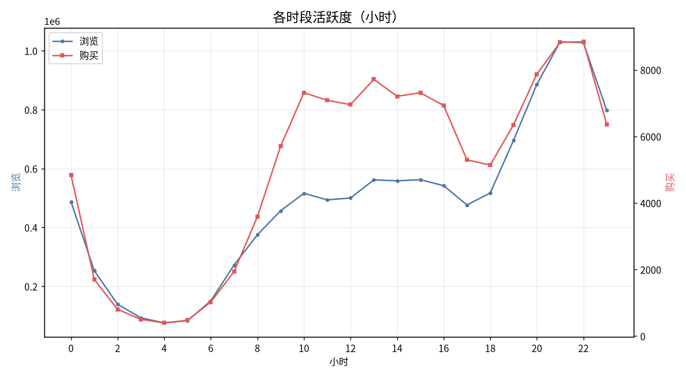

# 淘宝用户行为数据分析

基于阿里云天池公开数据集，使用 MySQL + Excel 完成的全流程电商用户行为分析。涵盖用户行为分布、时段/星期规律、转化路径诊断、RFM 用户分层与品类偏好，输出从清洗、计算、可视化到业务建议的完整实战闭环。

## 项目简介

- 数据集：2014 年阿里巴巴移动推荐数据集（`tianchi_mobile_recommend_train_user`），**12,256,906 条**行为记录，覆盖 10,000 名用户
- 数据来源：阿里云天池。因体积原因未随仓库提供，请自行前往天池下载后导入
- 时间范围：2014-11-18 ~ 2014-12-18（共 31 天）
- 行为类型：浏览（pv）、收藏（fav）、加购（cart）、购买（buy）
- 分析目标：洞察流量结构与用户习惯，定位转化薄弱环节，建立用户价值分层，为精细化运营提供决策依据
- 技术栈：MySQL（数据预处理与指标计算）、Excel（数据透视表、图表、分析报告）

```
taobao-user-behavior-analysis/
├── excel/
│   └── taobao_user_analysis_report.xlsx   # 分析报告与可视化图表
├── sql/
│   ├── data_preview.sql
│   ├── data_cleaning.sql
│   ├── behavior_analysis.sql
│   ├── hour_analysis.sql
│   ├── week_analysis.sql
│   ├── funnel_analysis.sql                # 事件级级联比率 + 严格有序漏斗 + 意向分组
│   ├── rfm_analysis.sql                   # NTILE 分位打分 + 经典 8 分类
│   └── category_analysis.sql
├── results/                               # 各查询的原始结果 CSV
│   ├── behavior.csv
│   ├── hour.csv
│   ├── week.csv
│   ├── funnel_strict.csv
│   ├── intent.csv
│   ├── rfm.csv
│   ├── category_by_conv.csv
│   └── category_by_buy.csv
├── images/
│   ├── user_behavior_pie.png
│   ├── hourly_activity_chart.png
│   ├── weekly_activity_bar.png
│   ├── conversion_funnel_chart.png
│   ├── rfm_segmentation_pie.png
│   └── category_performance_bar.png
└── README.md
```

## 分析流程与核心发现

### 1. 用户行为整体分布

| 行为类型 | 次数 | 占比 |
|---|---|---|
| 浏览 | 11,550,581 | 94.24% |
| 收藏 | 242,556 | 1.98% |
| 加购 | 343,564 | 2.80% |
| 购买 | 120,205 | 0.98% |

浏览占绝对主导，购买行为仅占 0.98%，从浏览到购买的转化路径长，提升转化空间大。

### 2. 时段活跃度（小时维度）

- 浏览最高峰：**21 点**（浏览 1,030,483，购买 8,829），22 点紧随其后（浏览 1,027,269）
- 购买最高峰：**22 点**（购买 8,845），与 21 点基本持平
- 核心购物时段：晚间 19-23 点，其中 20、21、22 点浏览均超 88 万
- 最低谷：凌晨 4 点（浏览 75,832，购买 397），此时可基本不做资源投入
- 趋势：活跃度从早 6 点开始攀升，至晚间达到顶峰，符合典型电商“下班经济”特征

### 3. 星期活跃度

| 星期 | 浏览量 | 购买量 |
|---|---|---|
| 周四 | 1,874,214 | 17,635 |
| 周三 | 1,827,406 | 17,975 |
| 周二 | 1,824,959 | 18,035 |
| 周五 | 1,618,868 | **24,809** |
| 周日 | 1,497,973 | 13,702 |
| 周一 | 1,470,008 | 14,518 |
| 周六 | 1,437,153 | 13,531 |

周五购买量一枝独秀（24,809，比次高的周二高出约 38%），是转化效果最好的一天；周二到周四浏览高但购买相对平稳。周末流量不升反降，说明该用户群更偏向有目的的集中购买，而非周末闲逛型消费。

### 4. 多维度转化诊断

转化分析从三个层次展开，避免把“购买覆盖率”误当成“转化率”。

**（1）事件级级联比率（流量结构）**

| 指标 | 数值 |
|---|---|
| 每 100 次浏览对应加购 | 2.97 次 |
| 每 100 次浏览对应购买 | 1.04 次 |
| 加购与购买的事件比 | 34.99% |

**（2）严格有序漏斗（用户 × 商品配对，路径必须时间递增）**

| 漏斗层级 | 配对数 | 逐级比率 |
|---|---|---|
| 浏览 | 4,677,501 | — |
| 浏览后加购 | 272,659 | 5.83% |
| 加购后购买 | 58,038 | 21.29% |
| 浏览→购买整体 | — | 1.24% |

**（3）意向分组购买率**

| 用户类型 | 用户数 | 购买用户 | 购买率 |
|---|---|---|---|
| 有收藏或加购 | 9,324 | 8,551 | 91.71% |
| 无收藏且无加购 | 676 | 335 | 49.56% |

有收藏/加购行为的用户购买率约为无意向用户的 **1.85 倍**，意向用户价值极高，应重点优化收藏夹和购物车的二次触达（提醒、优惠券等）。注意意向分组是**相关关系而非因果**，收藏加购与购买可能同受“购买意愿”驱动。

### 5. RFM 用户价值分层

基于 RFM 模型（数据集无金额字段，M 以购买不同商品数代理），用 `NTILE(5)` 分位打分，将 8,886 名购买用户分为 8 类：

| 客户类型 | 人数 | 占比 | 平均 R（天） | 平均 F（次） | 平均 M（商品数） |
|---|---|---|---|---|---|
| 重要价值 | 1,997 | 22.5% | 0.7 | 30.7 | 25.7 |
| 重要保持 | 1,359 | 15.3% | 5.9 | 21.8 | 18.8 |
| 重要发展 | 89 | 1.0% | 0.9 | 10.4 | 10.4 |
| 重要挽留 | 109 | 1.2% | 6.7 | 10.2 | 10.2 |
| 一般价值 | 91 | 1.0% | 0.8 | 13.6 | 8.5 |
| 一般保持 | 107 | 1.2% | 7.0 | 13.3 | 8.3 |
| 一般发展 | 1,378 | 15.5% | 0.9 | 5.8 | 5.3 |
| 一般挽留 | 3,756 | 42.3% | 10.5 | 4.4 | 4.1 |

- **重要价值客户（22.5%）**：近期高频购买，是基本盘，需 VIP 维护、个性化推荐、优先客服
- **一般挽留客户（42.3%）**：约 10 天未买、低频，是最大的待召回群体，需大力度优惠券、短信/推送唤醒
- **一般发展客户（15.5%）**：近期有购买但频次低，可通过会员、复购券提升频次
- **重要保持客户（15.3%）**：购买频次高但近期未买，需重点防流失
- 结构说明：重要四格合计 40%、一般四格合计 60%，这是 NTILE 阈值构造的必然结果；因 F 与 M 近似共线，8 类实际退化为 4~5 个有效类别

### 6. 商品类目偏好

**类目转化率 Top 10（浏览量 ≥ 100，按转化率排序）**

| 类目 ID | 浏览 | 加购 | 购买 | 转化率 |
|---|---|---|---|---|
| 2178 | 118 | 11 | 34 | 28.81% |
| 2949 | 1,474 | 39 | 373 | 25.31% |
| 13040 | 126 | 15 | 28 | 22.22% |
| 6544 | 118 | 0 | 17 | 14.41% |
| 8439 | 125 | 5 | 17 | 13.60% |
| 5814 | 103 | 8 | 14 | 13.59% |
| 10405 | 145 | 15 | 19 | 13.10% |
| 11861 | 121 | 6 | 15 | 12.40% |
| 5379 | 107 | 13 | 13 | 12.15% |
| 7843 | 109 | 11 | 12 | 11.01% |

**类目购买量 Top 5**

| 类目 ID | 浏览 | 购买 |
|---|---|---|
| 6344 | 85,369 | 2,208 |
| 1863 | 371,738 | 2,000 |
| 5232 | 135,506 | 1,611 |
| 6977 | 22,806 | 1,324 |
| 8877 | 63,396 | 1,072 |

> 参考基准：全站整体转化率（购买 ÷ 浏览）= 120,205 ÷ 11,550,581 ≈ **1.04%**。以下结论均以此基准为参照。

- **高转化潜力类目**：类目 2949 浏览 1,474 次带来 373 次购买，转化率 25.31%，在“浏览量 ≥ 100”的 3,873 个类目转化率排名中**位列第二**（第一为类目 2178，28.81%），且绝对购买量较大，可优先增加推荐流量
- **高流量、零加购类目**：类目 10121 浏览 3,110 次、购买 267 次，转化率 8.59%，**仍约为全站均值 1.04% 的 8 倍**（在“浏览量 ≥ 100”的类目中排第 19 位）；但其**加购记录为 0**，说明用户几乎不经购物车直接下单，宜在首屏设置快速购买入口；详情页承接仍有优化空间
- **无加购直接购买**：类目 6544、12309、12514 等无加购记录却有购买，可能是冲动消费品，适合首屏快速购买入口

## 数据可视化展示













## 如何复现

1. 将 `tianchi_mobile_recommend_train_user.csv` 导入 MySQL（库名 `taobao`，原始表名 `淘宝用户分析`）
2. 按顺序运行 `sql/` 下脚本：`data_preview.sql` → `data_cleaning.sql` → 各分析脚本
3. 导出查询结果至 Excel，用数据透视表或图表功能完成可视化
4. 完整报告详见 `excel/taobao_user_analysis_report.xlsx`

## 遇到的坑与解决

- **漏斗口径错误**：最初把“有过浏览的用户里有多少人最终购买”当成转化率（购买覆盖率），数值高达 80% 以上，实际是用户覆盖而非转化。改为事件级、严格有序漏斗、意向分组三个层次后口径才清晰
- **未去重导致转化率异常**：计算转化率时未按独立用户去重，导致转化率 > 100%，改用 `COUNT(DISTINCT user_id)` 后恢复正常
- **RFM 硬编码阈值失效**：最初用固定阈值导致高价值用户占比超过一半、分层失去意义，改用 `NTILE(5)` 按分位打分后各层占比合理
- **抽样数据打断行为序列**：在抽样数据上计算严格漏斗会明显低估转化率（前序行为可能被抽样丢弃），改用完整数据集后才得到真实比率
- **性能优化**：数据量达 1,225 万行，通过建立 `(user_id, item_id)` 组合索引，严格漏斗查询时间大幅缩短

## 业务优化建议

1. **强化购物车催付**：加购后购买率约 21%，可在购物车设置“库存紧张”“限时优惠”提醒，对加购未购用户配置自动推送
2. **集中火力在周五与晚间**：周五购买爆发、20-22 点为黄金时段，适合安排秒杀、直播等重磅活动
3. **召回一般挽留客户**：42.3% 的用户约 10 天未买，可设计“老客专属回归礼包”，通过短信/推送唤醒
4. **维护重要价值客户**：22.5% 的高价值客户贡献高频购买，应提供完善的售后与会员权益，防止流失
5. **品类优化**：对高流量、零加购的类目（如 10121、12514）设置首屏快速购买入口，缩短下单路径；将推荐流量向高转化类目（如 2949、2178）倾斜；对无加购直接购买的类目简化结算流程
